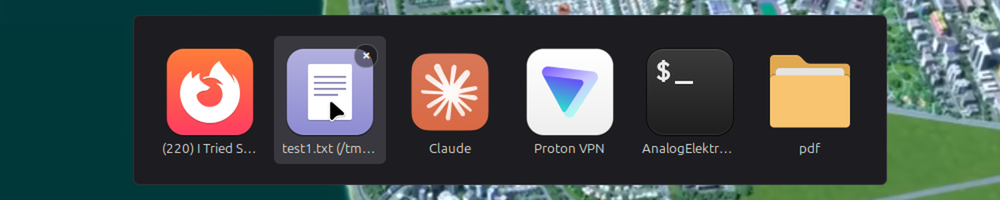

# cinnamon-closetab

Windows-11-style close buttons on Cinnamon's Alt+Tab switcher. Hover a preview,
click the `×` or press <kbd>Q</kbd>, and that window closes — without switching
to it and without dismissing the switcher.



> **Linux Mint 22.3 (Cinnamon 6.6) only.** It hooks directly into Cinnamon's
> stock switcher internals, which move between releases. Other versions are
> untested and will likely break.

## Quickstart

```bash
git clone https://github.com/maxwellmollersten/cinnamon-closetab.git
cp -r cinnamon-closetab/closetab@maxwellmollersten ~/.local/share/cinnamon/extensions/
```

Then enable it in **Menu → Preferences → Extensions → Manage**. No restart or
logout needed.

Hold **Alt**, press **Tab**, and hover a preview.

| | |
| --- | --- |
| Click a preview | switch to that window, as always |
| Click the `×` | close that window, switcher stays open |
| <kbd>Q</kbd> | close the selected window |
| Middle-click | close the hovered window |

Closing uses `Meta.Window.delete()` — the same polite request as Alt+F4 — so an
app with unsaved work still gets to show its "Save changes?" dialog. Nothing is
ever killed.

<details>
<summary>Enabling from the terminal instead</summary>

Don't use `gsettings set org.cinnamon enabled-extensions "['closetab@maxwellmollersten']"` —
that **replaces** the list and silently disables every other extension you have.
This appends instead:

```bash
python3 - <<'PY'
import subprocess, ast
UUID = 'closetab@maxwellmollersten'
cur = subprocess.check_output(['gsettings', 'get', 'org.cinnamon', 'enabled-extensions'], text=True).strip()
lst = [] if cur.startswith('@as') else ast.literal_eval(cur)
if UUID not in lst:
    lst.append(UUID)
    subprocess.run(['gsettings', 'set', 'org.cinnamon', 'enabled-extensions', str(lst)])
print(lst)
PY
```
</details>

## Uninstall

Disable it in **Menu → Preferences → Extensions**, then:

```bash
rm -rf ~/.local/share/cinnamon/extensions/closetab@maxwellmollersten
```

Disabling closes any Alt+Tab switcher that is currently open and restores every
Cinnamon function the extension patched; nothing under `/usr/share/cinnamon/`
is ever touched.

## More

Behaviour toggles (always-show the `×`, disable middle-click, debug logging) are
constants at the top of
[`extension.js`](closetab@maxwellmollersten/extension.js). See
[NOTES.md](NOTES.md) for how it hooks into Cinnamon and why.

## License

MIT — see [LICENSE](LICENSE).
